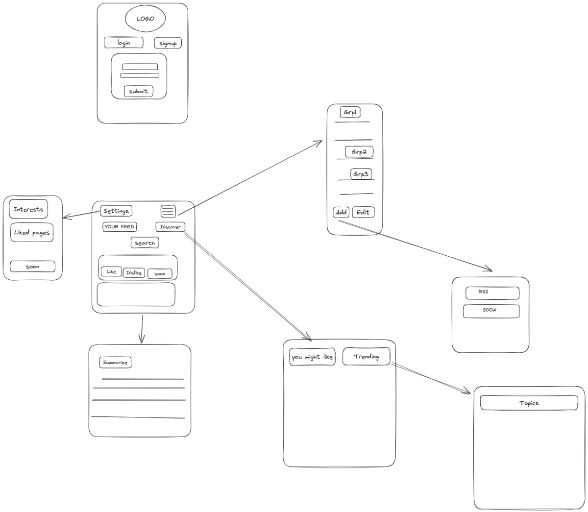

بسم الله الرحمن الرحيم
- [for all team](#for-all-team)
- [front end references....](#front-end-references)
- [for backend](#for-backend)
- [for AI](#for-ai)
- [for front end](#for-front-end)
  - [how to finish tasks and references](#how-to-finish-tasks-and-references)
    - [previous works to get logic](#previous-works-to-get-logic)
  - [components](#components)
  - [css and components](#css-and-components)
  - [use case 01](#use-case-01)
  - [use case 02](#use-case-02)
- [intialize repo](#intialize-repo)
- [components--sprint\_1](#components--sprint_1)
- [Landing page](#landing-page)
  - [home\_page](#home_page)
- [myFeed\_page](#myfeed_page)
  - [login/signup\_page](#loginsignup_page)
  - [logoPopup](#logopopup)
  - [resources\_page](#resources_page)
  - [add\_resource\_page](#add_resource_page)
  - [discover\_page](#discover_page)
  - [news\_item\_page](#news_item_page)
  - [news\_item\_page\_viewer](#news_item_page_viewer)
  - [preferences\_page](#preferences_page)
- [design choices](#design-choices)
  - [in discover\_page.you\_may\_like\_this](#in-discover_pageyou_may_like_this)
  - [Summary\_article](#summary_article)
    - [upload just link to server  @DATABASE/SERVER](#upload-just-link-to-server--databaseserver)

## for all team
-  model

- ask for anything you think not clear....
- only see your for sections (search with ctrl+f)
## front end references....
- 
## for backend
- search in this file  for ::: DATABASE/SERVER to know  backendend tasks
- read carefully this is what needed..
## for AI 
- search in browser for ::: API usage/consume is only frontend task
- read carefully this is what needed..

## for front end
- read carefully this is what needed..
- you will find references (ان شاء الله) like this project (inspect what you need) 
- inspect css and js from these sites !!!!
- to learn css well (ان شاء الله)in this project, donot use CSS libraries like material UI, ANTD,bootstrap...
- Read all the file carefully 
- names with  underscores (_) is are pages and routed through ReactRouter..
- page.anything means sub page implemented with hash routing...
- any opened page will be implmented ان_شاء_الله
   1. using react only (popup page) donot worry 
   2. or using reactRouterDOM (route to new page) donot worry 
- if a page is written like that home_page.myFeed_page so  myFeed_page is children of home_page (React Router) donot worry
- popups should made by conditional rendering only React..
- the ? in this  files means not finished section
- use white colors !!!
- when will we use BACKEND 
### how to finish tasks and references
- we need beautiful ui/ux with light/dark colors....
- we need logic that works with the same methods illustrated in tasks  (ask about what you donot understand)
#### previous works to get logic
- https://github.com/GetStream/Winds/tree/master?tab=readme-ov-file
### components
- https://uiverse.io/
### 
### css and components
### use case 01
```
if user first login system.... 
   get all the state from server...
else 
read the state from something called redux resilient (library store data in local storage)
```
### use case 02
- any update to the redux state...

## intialize repo  
- [ ] install redux 
- [x] fork repo   
- [x]  open vscode and go to the  project folder then     
1. Press Ctrl+Shift+P to open the Command Palette.
2. run  git clone
3. enter your forked link to repo
4. choose folder to the project
> if you donot know how To deal with commets, pull requests ask on group.....
1. run npm install to install required libraries react,...
## components--sprint_1
- create the redux logic  
   - [ ] redux store
   - [ ] redux slices
## Landing page
- [ ] onClick route  
- [ ] onClick login 
  - [ ] fetch user data
  - [ ] store user data with redux and local storage
  - [ ]  store user token local storage
  - [x] route to homepage
  - [ ]  protect homepage route
### home_page
- [ ]  navbar  
  - [ ]  onClick userIcon **show**  logoPopup.
  - [ ]   onClick theme Icon **toggle**  darkMode/lightModel 
- [ ]  onClick discover icon **show**  home_page.discover_page
- [ ]  onClick my feed icon **show**  home_page.myFeed_page
- [ ]  onClick search **show** news_item_page
- [ ]  onclick resources icon **show** resources_page
## myFeed_page
- [ ]  **show** news_item_page
- [ ]  onClick **view** options icons **change** shown 
- [ ]  spinner 
- [ ]  **load** first 10 items
- [ ]  store in redux ?
- [ ]  donot store? 
> q how to store feeds with redux??
### login/signup_page
- [ ]  logo
- [ ]  login button
- [ ]  sign up button
- [ ]  form with submit 
- [ ] onLogin success
     - [ ] spinner
     - [ ] **fetch** user subscription json state ,groups,channels,thumbnail,urls... 
     - [ ] **store** fetched state  redux-resilient. donot worry
     - [ ]  onClick a channel **read** its data from  its own server DATABASE/SERVER?
     - [ ]  onClick a channel **read** data from our server ?
     - [ ]  
> fetch articles from server or on our own server ??
### logoPopup
- logout 
    - [ ]   **redirect** to login/signup_page
    - [ ]  **delete** token
- settings
    - [ ]   **open**  preferences_page
    - [ ]   
### resources_page
- groups
- [ ]  **show** items in group
- Actions
   - [ ]  **delete** resource
     - [ ] **update** subscripton on server
   - [ ]  **open** add_resource_page
### add_resource_page
- Rss
   - [ ] update subscripton on server
- [ ]  Soon
### discover_page 
-  you might like section
   - [ ] simple useEffect fetches 10 elements by 10 elements.... DATABASE/SERVER
   - [ ] subscripe button  
### news_item_page 
- [ ]  thumbnail
- [ ]  actions bar
   - [ ]  on click **open** news_item_page_viewer
   - [ ]  on click sum up icon **open**  Summary_article popup
   - [ ]  on click icon unsubscribe Redux **dispatch unsubscribe** from this publisher
   - [ ]  on click  like  Redux**dispatch like**
   - [ ]  on click  Redux **dispatch like** 


###  news_item_page_viewer 
- [ ]  share link icon

### preferences_page 
- [ ] **show/edit/add/delete** interests
- [ ]   Redux **dispatch interestes action** 

## design choices  
###  in discover_page.you_may_like_this
- upload user preferences when needed ex: click on discover page..@DATABASE/SERVER
> @AI Recommendation model is fed with (userVector,available articles) to generate ItemList in discover_page.you_may_like_this
> this require all news items to be topic classified ......  @AI
  ex: a donald trump newsItem should have an array in the database with (donaldtrump,usa,news,ploitics)
> I suggest using about 500 rss feed to get recommendations from .... @DATABASE/SERVER collect data from 
### Summary_article
#### upload just link to server  @DATABASE/SERVER
- server should return summarized text.... @DATABASE/SERVER @AI
