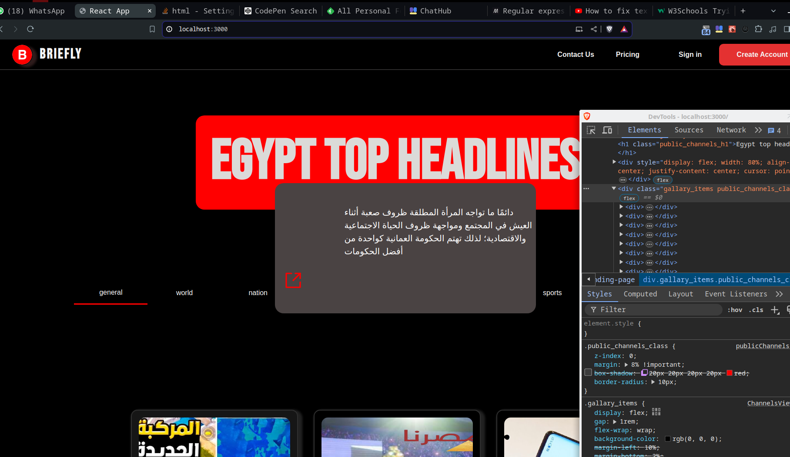
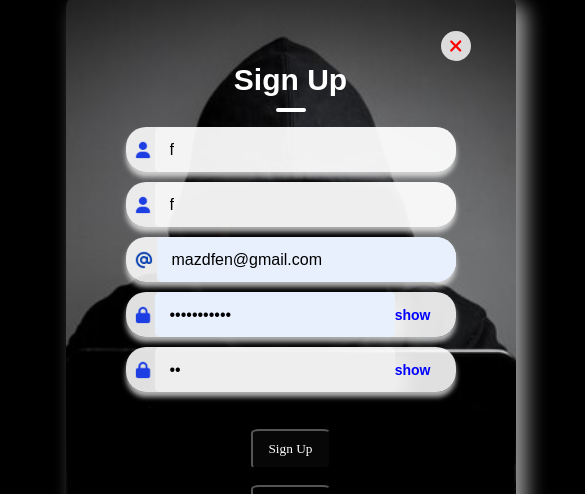

# Project
اللهم علمنا ما ينفعنا وانفعنا بما علمتنا
### TODO (low priority 🔼)
- +apis popups for all apis ex:if token expire.
- pricing implementation @backend
- [ ] optimize images
- theme,translation 
- +backend @zaki #pro_grad useless /checkvalidation
- #pro_grad slow update in gnews apis
- #pro_grad lazy loading

- +<LandingPage/> conditional render create account and sign in if user is logined @zaki
-  +<SubscripedChannels/>:50 (line 50 in component file) useeffect when state change log it (monitor system) usecallback,usememo
- @backend {{Domain}}/api/v1/Auth/ResetPassword , public, no need the reset code
- +backend saved articles,
- #pro_grad countries carousel 5 in +landingpage

- #pro_grad src/routes/AddFeed.js:8 todo #zaki //2.move it  inside the addFeed fn  component// 3. and try subscribe to an rss  //4. find why there is error

- #pro_grad frammerMotion  addFeed ,gallaries,landingPage
- #pro_grad cache apis
-  @backend contact us form  @zaki {due:2024-06-27}
- #pro_grad remove useless components and eslint erro
- host {due:2024-06-22}

- #pro_grad chng spinner of mouse when click to trigger request in +resetpassword pn clik send password send code spinner inside btn
- #pro_grad in /home/addfeed bad mobile screen

- spinner /lazy loading between req and response #pro_grad in  +articleModal,+channelModal,+userArticles,+publModal, on all routes/modals

- 4. netwerk error #pro_grad @hazem
- pageNumber bad in local storage

### pending 

### High
- website demo no host,no hazem laptop

### In Progress
### Done ✓
- +articleModal link svg 
- +comments if many comments breaked 
- redux
- responsive

- bad red
- +addrss validation
- compiled errors

- bad z-index

- follow/unfollow
- red message on save,empty modal
- descriptoion rm
- +articlemodal reltaed artivles api
- pagniation

- 2 bugs with +backend
- userarticles bug
-  comments apis
-  save  article  api
- docs @hazem

- searcg bar
-  bad description in +landingPage 
- bad api cors error
-  shaib meeting @hazem {due:2024-06-30}
- undefined bug when host
- plz login bug after click home
- responsive project
- channel name when unsubscribe all
- userarticles flex
- if no subscriptions> 
   -  close increase/decrease btns
- if user  show channel articles then unsubscribe
  - enssure +userArtickles donot show its articles

- redirect in blank page
- bad styling +publicApi
-  1. +addrss text
2. +savedarticles title
3. Follow!unfollow color
4. +profile username
6.
8. Icons +comments h
9. Icons styling
-  10.  Saved articles , message alert +savedsrtivles
-  11. Modalarticle black background
-  12. Favicon
-  13. AlertRed always
-  14. +Discover follow bad unfollow backend
- host and bugs
- #pro_grad pagenation   
1. solve eslint problems @zaki
2. check host @hazem
3. team tests @otherTeam
4. team active @otherTeam
- #pro_grad in +addfeed  undefined . if rss https://electronicintifada.net/rss.xml(make it resilient)
- +addfeed style

-  add new tasks ,mobile/lap/reset  @hazem {due:2024-06-27}

- make/userdata +backend

- Note_case_useless_state , statful or not flag,if condition to update state 
- redux,spinners,model error 

- +landingpage bad modal  
-  upload videos  @hazem {due:2024-06-27|e2d} {overdue:2024-06-29}
- #pro_grad +PublicChannels bad text general world,.. capital case
- - #pro_grad +<publicChannels/> add countries in same way
- in +userArticles +discover ,+publicChannels replcae intial articles with spinner #pro_grad
- +resetpassword styling

- global error manage system with redux
- add error boundry to catch all thrown errors 
#TEST ex: rm token, try go /home @zaki
- #pro_grad modal styling
- #pro_grad <Subscriptions/> on click bad rectangle on border radius

- #pro_grad rm hacker image ,change project name in +landingPage be briefed  +landingPage +<Login/>

-  bad style in +subscribedlist when #pro_grad

- @hazem +userArtickles article styling
- rss name in +userArticles before articles 
- +<SubscribedList/> bad styling 
- #pro_grad default subsciption choice in +userArtickles

- {{Domain}}/api/v1/Rss/4 #pro_grad #backend donot add neww info,cannot use it
- #project_graduation on resetPassword, display enter code input field when confirm model appear

- bad images #backend #pro_grad
      
- #pro_grad spinner intead empty card intially in +<PublicChannels @zaki
- #pro_gra token expire blank /home

- +<SubscribedList/> state to color the selected rss >>> add its name before the articles @zaki
- style profile component +<Home/>  @zaki 
- +<NavBar/> bad logotext @zaki {due:2024-06-27} 
- bad modal  
-  custom Hook   {due:2024-06-27}
 - [x] +<PublicChannels/> 
 - [x] +<SubscribedLIst/> 
 - [x] +<SubscriptionsChannels> 
 - [x] +<MainLandingPage/> 
 - [x] +<create_Account/> 
 - [x] +<UserArticles/> 
 - [x] +<UserArticle/> 
 - [x] +<ArticleCard/> 
 - [x] +<login/> 
 - [x] +<protected/> 
 - [x] +<Login/>
 - [x] +<create_Account/>
 - [x] +<ResetPassword/>    
 -   +<addFeed/>,+google_login,+ChannelCard,+discover

- bad modal close in +UserArticles  
- +<LandingPage/> if no images same endpoint result no categories @zaki
- in <ArticleCard/> and <ChannelCard/> add placeholder images api doesnot provide one. @zaki

- [x] custom hook and 5 useDispatches... 

- bad fncs routing in Protected
- +<ArticleModal> make good component for an article @zaki
- +<ArticleModal> @backend null article category,summary,images in
- remove all chanells from +<Home/> backend not implement it @hazem
- +<UserArticles/> bad when consume api/v1/Article/GetRssArticle/ bad article modal error @hazem
- [x] #project_graduation if sign with google ,store token,refresh token then forward to home
- #pro_grad all channels api in +</home/>
- #project_graduation on signup success bad state message
- update,create,delete by admin, ?? #backend #pro_grad (current no )
- channesl modals, btn toggles ,array state with id
- replace <Navigate to="/" />;
- multipages navigation +<Channels/>
- +<UserArticle/> show +<ArticleModal data={data}/> @hazem
- [ ] +<UserArticles/> consume Articles API @zaki

    - 🗄️ 
    - errors in api

    - task is the same like other a is
    - +<Protected/> blanc if invalid token,no popup states

  - articles and subsciptions view
#pro_gra bad profile component
    - move +<SubscripedChannels/> into +<homeArticles>
    - add subscription Horizontal into +<homeArticle>
    - onClick list update Displayed Articles...
    - +<Discover> onClick show Articles in +<ArticleModalList>
- #project_graduation on signup no msg confirm email

    - PROS:
      1. user see articles per RSS or all...
      2. remove useless Subsciption route
      3. subscription freindly next to articles
      4. user see discover items before subscipe

  - +<ArticleModal/> global in homeLayout ,to solve scroll problem
  - +<SubscribedChannels/> show +<ArticleModal data={data}/> 
  - +<DiscoverChannels/> show +<ArticleModal data={data}/> 
  - record 2 endpoints 
  - bad model position and padding in +<ArticleModal> 
  - when scroll position change 

  - [ ] zaki install extntions @zaki
  - +<Home/> remove token on logout @zaki
  - +<Home/> if we on /home/anypage then reload page, the focus of buttons of left will be first always @zaki
  - follow/unfollow local state which change buttons follow and unfollow @hazem
    - +<Subscription/> 2apis_chain_promise on unflow request,immediatly remove from front end,update state
    - +<dISCOVER> update button(follow/unflow) state
  - merge request from zaki @hazem
  - screen from todo file progress @hazem
  - auth API v2 (admin endpoints. /rss/:id) @hazem call backend
  - close modal on click the wrapper 
  - modal not updates on multi clicks 
  - OVERWRITIE browser stack (when use useNavigate) 
  - [x] in err msg no exit btn @zaki
  - [x] @zaki +<Alert/> component in +<Login/> +<createAccount/> :must be top all components
  - +<Login/> bad route to resetpassword (reload) 
  - +<login/> , with this data ,two messages appear success then failed 
    
  - [x] @hazem consume rss API
  - [x] consume auth API
  - [x] store email to local storage
  - [x] input code from email
  - [x] send code,email to api
  - [x] msg confirmed or not
  - [ء] meeting {due:2024-06-20} @team
   - q/a anything
   - what we did
   - TODO file > a must
   - contribute in file +,@
   - TODO extention >
   - live demo
   - inProgress section discuss
   - q/a anything
  - [x] forget password css
  - [x] API end points
  - [x] two logins appear success then err
  - [x] testing mahmoud example
  - [x] ~~ homepage ~~
  - [x] ~~google auth http://65470565009-pjolbjeuuds1s29b764lgv86vo0ova6i.apps.googleusercontent.com~~
  - [x] big msgs use Mazefdn@123
  - [x] ~~landingpage~~
  - [x] rm admin mail ahmed
  - [x] remove tring email and password
  - [x] login needs 2 clicks
  - [x] no backg img repeat
  - [x] From JWT token return the data
  - [x] rss database
- #project_graduation signup second confirm pass field
- #project_graduation in +<ResetPassword/> component, if statuscode from API is 404 show err and donot show enter code field @zaki
- +<ResetPassword/> @hazem
 * states
 when state 1>input state 1 
 when state 1>span state 0 
  1. toggleEmailInput1/btn1/other_mail(span)0
  2. toggleCodeInput/btn
  3. togglwPasswordInputs/inputs
   
 * setStates
   1. onSucceed:sendCodeHandler ->   set 1
   2. onSucceed:verifyCodeHandler -> set 2
   3. onSucceed:resetPaaswordHandler -> set 3

- rm strict mode @hazem
# notes

- // #Note_case user without thrown errors ,is authenticated one
- // Note_case: Token not defined

- book https://onedrive.live.com/edit?id=674A5A774401A7D9!sb36bc5f14f6a4e4e89b7d2228c08e7c2&resid=674A5A774401A7D9!sb36bc5f14f6a4e4e89b7d2228c08e7c2&cid=674a5a774401a7d9&ithint=file%2Cdocx&redeem=aHR0cHM6Ly8xZHJ2Lm1zL3cvYy82NzRhNWE3NzQ0MDFhN2Q5L0VmSEZhN05xVDA1T2liZlNJb3dJNThJQkk1cWhNX2NuYzQtNUR4Ukp6QmxDRWc_ZT1Wa2tsemQ&migratedtospo=true&wdo=2 ِ@hazem

- this account works :
  user: hazemk537@gmail.com
  password:Ahmed@1234

-
## react Book
- reactjs book @hazem  
 - how
 - cross platform
 - from js to nextjs and reactjs
 - optimization in app
 - clean code in app
 - senior reviews how we handles
## rss feeds

// const rssList=["https://feeds.bbci.co.uk/news/world/rss.xml",
// "https://feeds.bbci.co.uk/news/uk/rss.xml",
// "https://feeds.bbci.co.uk/news/business/rss.xml",
// "https://feeds.bbci.co.uk/news/technology/rss.xml",
// "https://feeds.bbci.co.uk/news/science_and_environment/rss.xml"]

// bad rss feeds
https://www.singaporelawwatch.sg/Portals/0/RSS/Headlines.xml

## apis

- 
  https://www.postman.com/ahmedelshafey/workspace/newsapi/collection/26431110-9cce8afc-99db-415c-9403-8633d3895de4?action=share&creator=26431110&active-environment=26431110-756a9d34-ad97-4aae-9b2c-82a98b47e7a7
  > note:

1. 😃 there is a typo-error in the CheckValidationToken endpoint
2. Make it POST instead GET
